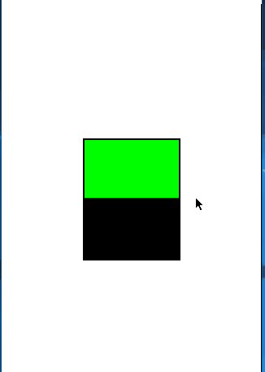

# remoteili9488

remoteili9488 is an remote client to wrap Atmel ASF ili9488 functions and draw locally on PC using Pygame, using Serial COM.

# Demo


# Requeriments

- Python 3.6+
- PySerial
- PyYAML
- Pygame

# Quickstart

## Atmel Project
- Comment file or Remove ili9488.c/.h and mxt_device_1.c/.h files 
(TIP: Use Edit->Format->Comment Selection)

- Comment/Remove "tfont.h" import in "main.c"
(TIP: Use Edit->Format->Comment Selection)

- Copy and include "remoteili9488.c" and "remoteili9488.h" in your project
(TIP: Remember to include in main.c)

- Make sure printf points to UART/Serial device (config_console)

## Mouse Support / Touch Device
- Call USART1_init to config interruption for RX data

- Start task_uartRx, task_Process 

- Use mxt_is_message_pending and mxt_handler to fetch data in your program

## remoteili9488

- Copy used bitmaps in bitmaps/ folder. Name of bitmap should be name of respective pointer in your main.c.

- If using fonts, config each in fonts.yaml. If font is not from System, copy ttf file in fonts folder.

- Start with:

```shell script
python3 main.py -p COM_PORT
```

## Other communications

Starting with v1.1.0

Instead of using Serial, you can also use stdin with --stdin flag or TCP socket (port 10000) with --socket flag.
